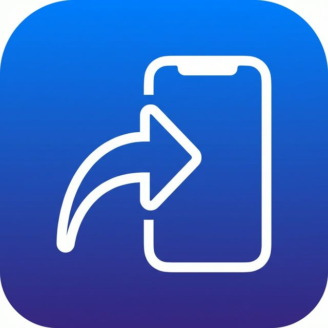

# send2iPhone

<p align="center">
  
</p>

<p align="center">
  <strong>Right-click any image in Chrome → send it to your iPhone via iMessage.</strong>
</p>

<p align="center">
  
  
  
  
</p>

---

## What is this?

A Chrome extension + lightweight local bridge that lets you send any image from the web to your iPhone with two clicks. No accounts, no cloud, no dependencies — everything stays on your Mac.

```
Right-click image → Chrome Extension → Local Bridge (localhost:7890) → AppleScript → Messages.app → 📱 iPhone
```

## Quick Start

### 1. Clone & start the bridge

```bash
git clone https://github.com/rS7Y/send2iPhone.git
cd send2iPhone/bridge
node server.js
```

```
📱 send2iPhone bridge server running on http://localhost:7890
```

### 2. Load the Chrome extension

1. Open Chrome → `chrome://extensions`
2. Enable **Developer mode** (top right)
3. Click **Load unpacked** → select the `extension/` folder

### 3. Configure

Click the **send2iPhone** icon in your Chrome toolbar → enter your iPhone number or Apple ID email → **Save**.

### 4. Send

Right-click any image → **📱 Send to iPhone** → it arrives via iMessage. ✨

---

## How It Works

The system has three parts, all running locally:

| Component | What it does |
|---|---|
| **Chrome Extension** | Adds "📱 Send to iPhone" to the right-click context menu on images. Sends the image URL to the local bridge. |
| **Bridge Server** | A zero-dependency Node.js HTTP server on `localhost:7890`. Downloads the image and invokes AppleScript. |
| **AppleScript** | Uses Messages.app's scripting interface to send the downloaded image as an iMessage attachment. |

Nothing leaves your machine. The bridge only listens on `127.0.0.1`.

---

## Auto-Start on Login (optional)

So the bridge is always ready when you need it:

```bash
# From the send2iPhone directory:
NODE_PATH=$(which node)
BRIDGE_PATH=$(pwd)/bridge/server.js

cat > ~/Library/LaunchAgents/com.send2iphone.bridge.plist << EOF
<?xml version="1.0" encoding="UTF-8"?>
<!DOCTYPE plist PUBLIC "-//Apple//DTD PLIST 1.0//EN"
  "http://www.apple.com/DTDs/PropertyList-1.0.dtd">
<plist version="1.0">
<dict>
    <key>Label</key>
    <string>com.send2iphone.bridge</string>
    <key>ProgramArguments</key>
    <array>
        <string>$NODE_PATH</string>
        <string>$BRIDGE_PATH</string>
    </array>
    <key>WorkingDirectory</key>
    <string>$(pwd)/bridge</string>
    <key>RunAtLoad</key>
    <true/>
    <key>KeepAlive</key>
    <true/>
    <key>StandardOutPath</key>
    <string>/tmp/send2iphone.log</string>
    <key>StandardErrorPath</key>
    <string>/tmp/send2iphone.err</string>
</dict>
</plist>
EOF

launchctl load ~/Library/LaunchAgents/com.send2iphone.bridge.plist
```

To stop: `launchctl unload ~/Library/LaunchAgents/com.send2iphone.bridge.plist`

---

## Project Structure

```
send2iPhone/
├── extension/                  # Chrome Extension (Manifest V3)
│   ├── manifest.json           # Extension config
│   ├── background.js           # Context menu + bridge POST
│   ├── popup.html              # Settings UI (brutalist dark theme)
│   ├── popup.js                # Settings logic (Chrome storage)
│   ├── icon-16.png
│   ├── icon-48.png
│   └── icon-128.png
├── bridge/                     # Local macOS Bridge Server
│   ├── server.js               # HTTP server — zero deps, port 7890
│   ├── send-image.applescript  # iMessage sender via Messages.app
│   └── package.json
├── icon.png                    # App icon (1024x1024)
├── setup.sh                    # Optional interactive setup
├── LICENSE                     # MIT
├── .gitignore
└── README.md
```

---

## Requirements

| Requirement | Details |
|---|---|
| **macOS** | Uses Messages.app + AppleScript |
| **Node.js** | v16 or later |
| **Chrome** | Any recent version |
| **iMessage** | Must be signed in on your Mac |

### Permissions

On first use, macOS will prompt you to grant **Automation** access for Messages.app:

**System Settings → Privacy & Security → Automation** → allow your terminal app to control Messages.

---

## Troubleshooting

| Issue | Fix |
|---|---|
| "Bridge Offline" notification | Run `cd bridge && node server.js` |
| Port 7890 already in use | The server auto-recovers — just run it again |
| "Not Delivered" in Messages | Check iMessage is signed in. Phone numbers are more reliable than email. |
| No context menu item | Reload extension at `chrome://extensions` |
| macOS blocks AppleScript | Grant Automation permission in System Settings |

---

## Privacy

- Phone number stored **locally** in Chrome extension storage (synced to your Chrome profile only)
- Bridge server listens on **`127.0.0.1` only** — not exposed to the network
- **Zero analytics**, zero telemetry, zero accounts
- Images are downloaded to `/tmp/`, sent, then immediately deleted

---

## Contributing

PRs welcome. Keep it simple — zero dependencies is a feature.

## License

[MIT](LICENSE)

## Contact

Send me a mail at rusty@tapzap.app
